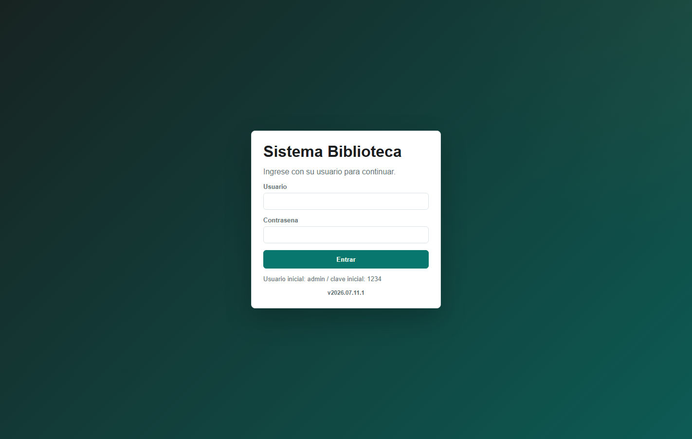
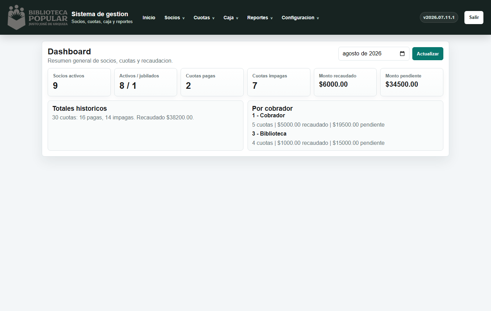
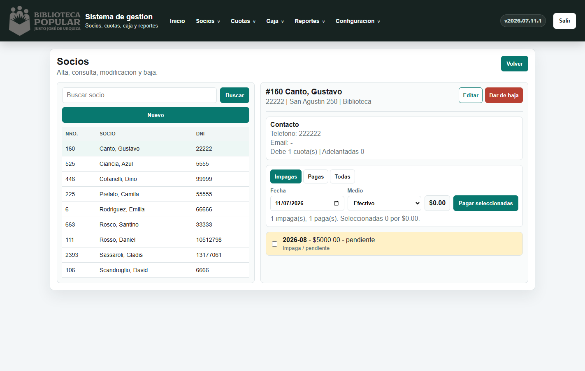
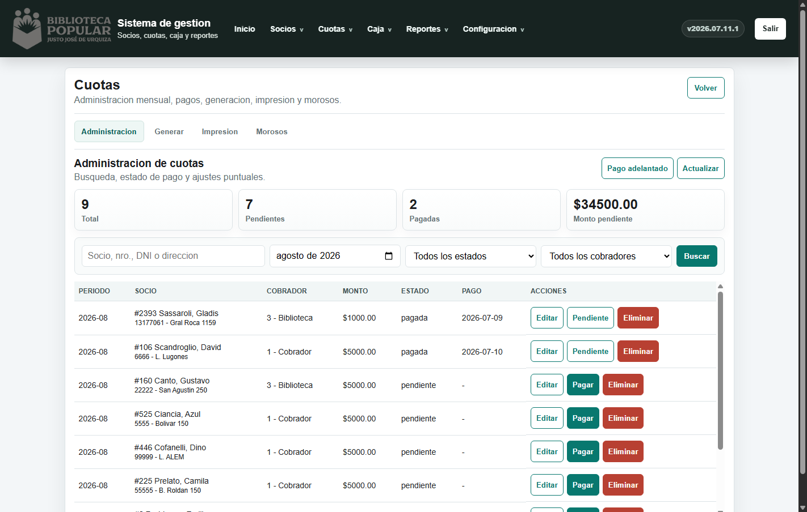
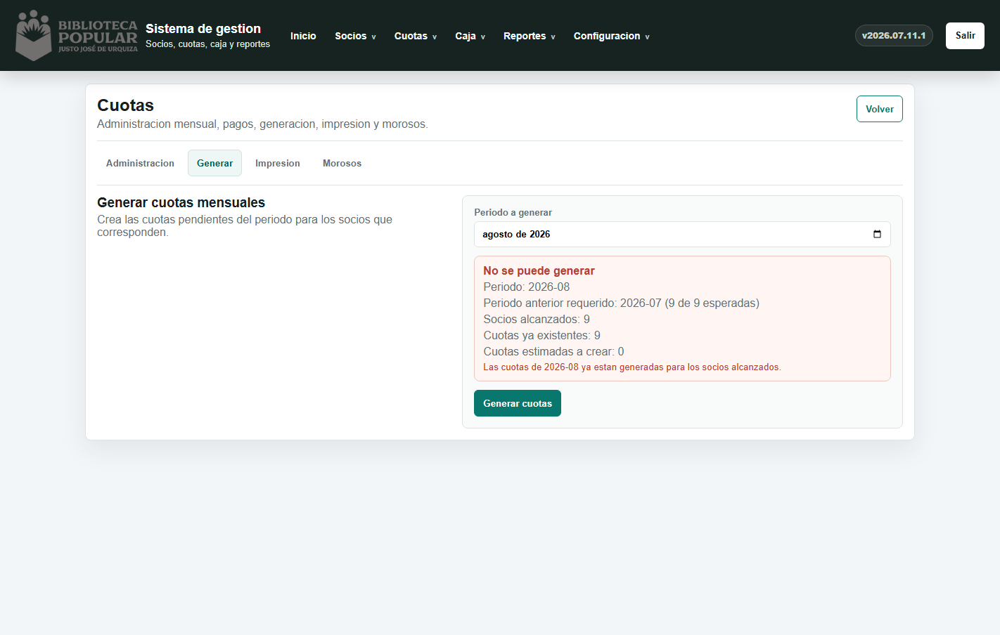
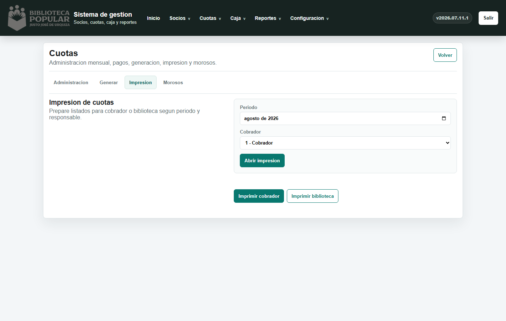
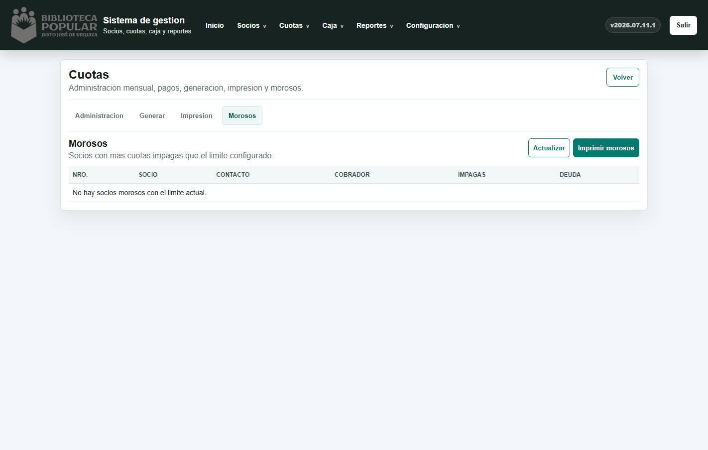
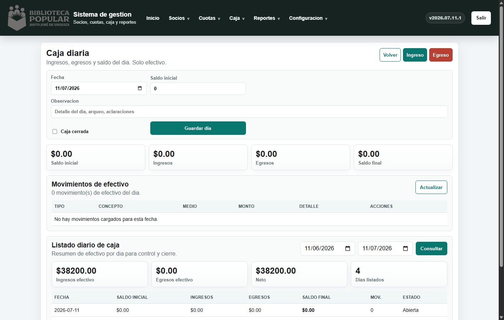
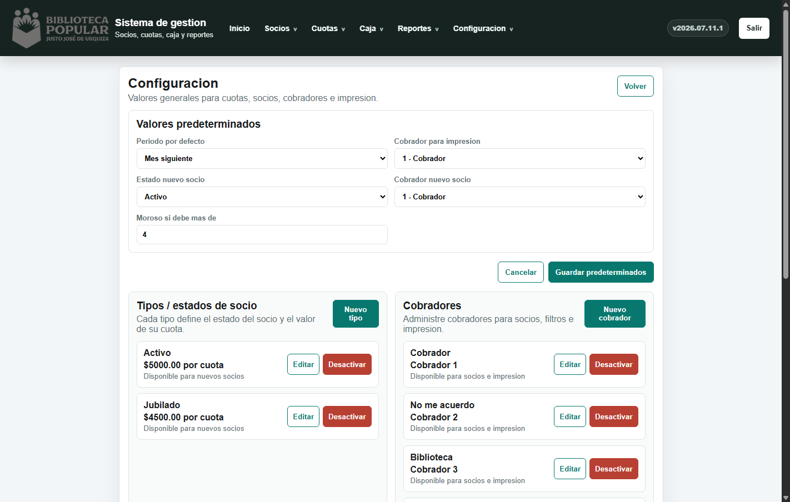

# Manual de usuario - Sistema Biblioteca

Versión del sistema: `v2026.07.11.2`  
Uso previsto: administración de socios, cuotas, caja diaria, reportes y configuración.

Desde el sistema se puede abrir en `Ayuda > Manual de usuario`.

## 1. Ingreso al sistema

Para entrar al sistema se debe ingresar usuario y contraseña.

Datos iniciales:

- Usuario: `admin`
- Contraseña inicial: `1234`

Recomendación: cambiar la contraseña inicial desde `Configuración > Seguridad` cuando el sistema quede en uso real.

## 2. Pantalla principal

Al ingresar se muestra el dashboard con un resumen general.

En esta pantalla se pueden ver:

- Cantidad de socios activos.
- Cuotas pagas e impagas del período.
- Monto recaudado.
- Monto pendiente.
- Resumen histórico.
- Recaudación por cobrador.

La versión del sistema aparece en la parte superior. Sirve para confirmar si la web tiene la última actualización.

## 3. Flujo diario recomendado: cobrar cuotas

La operatoria diaria principal es: llega un socio, se busca, se revisa deuda y se cobran una o varias cuotas.

Ruta recomendada:

`Socios > Listado`

Pasos:

1. Buscar el socio por nombre, apellido, DNI o número de socio.
2. Hacer click sobre el socio.
3. Revisar sus datos y cuotas.
4. Usar los filtros:
   - `Impagas`: muestra sólo cuotas pendientes.
   - `Pagas`: muestra cuotas ya abonadas.
   - `Todas`: muestra el historial completo.
5. Tildar las cuotas que el socio quiere pagar.
6. Indicar fecha de pago.
7. Indicar medio de pago.
8. Presionar `Pagar seleccionadas`.

Importante:

- Sólo el pago en `Efectivo` mueve la caja diaria.
- Transferencia, tarjeta, cheque u otro medio no generan movimiento de caja.
- El sistema no permite cobrar dos veces una cuota ya pagada.
- Si la caja del día de pago está cerrada, el sistema pedirá clave de administrador.

## 4. Administración de cuotas

Ruta:

`Cuotas > Administración`

Esta pantalla sirve para buscar, revisar y corregir cuotas.

Filtros disponibles:

- Socio, número de socio, DNI o dirección.
- Período.
- Estado: todas, pendientes o pagadas.
- Cobrador.

Acciones disponibles:

- `Pagar`: marca una cuota pendiente como pagada.
- `Editar`: modifica una cuota puntual.
- `Pendiente`: vuelve una cuota pagada a pendiente, con clave de administrador.
- `Eliminar`: borra una cuota, con clave de administrador.

Uso recomendado:

- Para cobros normales del mostrador, usar `Socios > Listado`.
- Para revisar errores, ajustes o búsquedas generales, usar `Cuotas > Administración`.

## 5. Pago adelantado

El pago adelantado se usa cuando un socio quiere abonar cuotas futuras que todavía no fueron generadas en la operatoria mensual.

Ruta:

`Cuotas > Pago adelantado`

Pasos:

1. Buscar el socio.
2. Elegir desde qué período comienza el adelanto.
3. Indicar cantidad de meses.
4. Indicar fecha de pago.
5. Indicar medio de pago.
6. Confirmar con `Generar y pagar`.

Reglas importantes:

- El sistema genera las cuotas futuras necesarias para ese socio.
- Si una cuota del rango ya está pagada, el sistema bloquea la operación.
- Si el medio es efectivo, se registra en caja.
- Si el medio no es efectivo, no mueve caja diaria.

## 6. Generación mensual de cuotas

Esta operatoria se realiza una vez por mes.

Ruta:

`Cuotas > Generar cuotas`

Pasos:

1. Elegir el período a generar.
2. Revisar el control previo.
3. Si el sistema indica que se puede generar, presionar `Generar cuotas`.
4. Confirmar la operación.

Controles del sistema:

- No permite generar un mes si el mes anterior no está completo.
- No duplica cuotas ya generadas.
- Muestra cuántas cuotas existen y cuántas faltan.

Uso recomendado:

- Hacerlo una sola vez al mes.
- Antes de generar, revisar que el período sea correcto.
- No usar esta pantalla para cobrar socios. Para cobros diarios usar `Socios > Listado`.

## 7. Impresión de cuotas

Ruta:

`Cuotas > Impresión`

Permite generar listados de cuotas pendientes para imprimir.

Pasos:

1. Elegir período.
2. Elegir cobrador.
3. Presionar `Abrir impresión`.

Notas:

- Los socios morosos no salen en la impresión normal de cuotas.
- Los morosos tienen su listado separado.

## 8. Morosos

Ruta:

`Cuotas > Morosos`

Esta pantalla muestra socios que superan el límite de cuotas impagas configurado.

Acciones:

- Revisar cantidad de cuotas impagas.
- Ver deuda total.
- Imprimir listado de morosos.

El límite para considerar moroso se configura desde `Configuración`.

## 9. Caja diaria

Ruta:

`Caja > Caja diaria`

La caja diaria registra únicamente movimientos en efectivo.

Incluye:

- Fecha de caja.
- Saldo inicial.
- Ingresos.
- Egresos.
- Saldo final.
- Movimientos del día.
- Listado diario por rango de fechas.

Reglas:

- Los cobros en efectivo de cuotas generan ingreso automático.
- Pagos por transferencia, tarjeta, cheque u otro medio no se registran en caja.
- Si una caja está cerrada, modificarla requiere clave de administrador.

Movimientos manuales:

- `Ingreso`: para registrar entradas de efectivo no asociadas a cuotas.
- `Egreso`: para registrar salidas de efectivo.

## 10. Configuración

Ruta:

`Configuración > General`

Desde configuración se administran valores generales del sistema:

- Período por defecto.
- Cobrador por defecto.
- Estado inicial de un socio.
- Límite de cuotas para considerar moroso.
- Tipos de socio y valor de cuota.
- Cobradores.
- Seguridad y auditoría.

Cambios sensibles requieren clave de administrador.

## 11. Seguridad

El sistema tiene dos niveles:

- Usuario y contraseña para entrar.
- Clave de administrador para acciones delicadas.

Acciones que requieren clave de administrador:

- Dar de baja socios.
- Eliminar cuotas.
- Volver cuotas pagadas a pendientes.
- Editar movimientos de caja.
- Eliminar movimientos de caja.
- Modificar caja cerrada.
- Cambiar configuración sensible.

## 12. Resumen de operatorias

### Operatoria diaria

Usar cuando viene un socio a pagar.

1. Ir a `Socios > Listado`.
2. Buscar socio.
3. Ver cuotas impagas.
4. Tildar las cuotas que paga.
5. Elegir medio.
6. Cobrar.

### Operatoria mensual

Usar una vez por mes para crear cuotas.

1. Ir a `Cuotas > Generar cuotas`.
2. Elegir período.
3. Revisar control.
4. Confirmar generación.

### Control de caja

Usar al cierre o revisión diaria.

1. Ir a `Caja > Caja diaria`.
2. Revisar ingresos y egresos.
3. Comparar saldo final con efectivo real.
4. Cerrar caja cuando corresponda.

## 13. Buenas prácticas

- No usar pago adelantado para cuotas ya generadas y pagas.
- Registrar correctamente el medio de pago.
- Usar efectivo sólo cuando realmente entra dinero a caja.
- Revisar el período antes de generar cuotas mensuales.
- No compartir la clave de administrador con usuarios que sólo cobran.
- Controlar la versión visible del sistema después de cada actualización.
